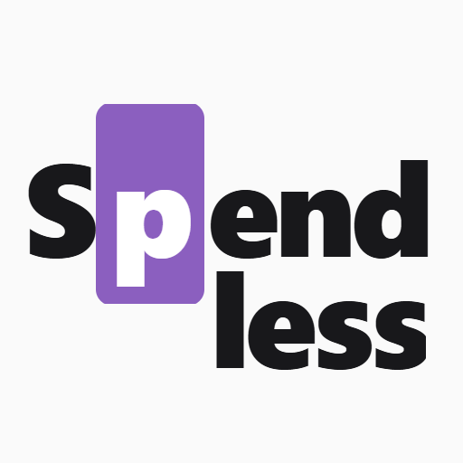

# Spendless - A Mindful Spending Tracker

<div align="center">
  
  <h3>Track your expenses mindfully</h3>
  <p><em>Understand your spending without the guilt trip</em></p>
</div>

## Overview

Spendless is a Progressive Web App (PWA) built with Ionic and React that helps you understand your spending habits through emotional awareness. Unlike traditional budgeting apps, we focus on understanding *why* you spend, not just what you spend on.

Ever check your bank account and wonder where all your money went? Spendless helps you track your spending in a way that's mindful, flexible, and actually works for you.

## Key Features

### 🎯 Mindful Spending Categories
Track expenses using 6 mindful categories that help you understand your spending patterns:
- **🛡️ Essentials** - Keeps my life running smoothly
- **☕ Rituals** - Daily habits that sustain me
- **✨ Rewards** - Brings ME joy and pleasure
- **📈 Growth** - Invests in my future self
- **💝 Connection** - Nurtures my relationships
- **⚡ Unexpected** - Life's surprises

### 💼 Wallet Management
- Create multiple wallets for different purposes (personal, groceries, entertainment)
- Set spending limits for each wallet
- Track how much you have left in real-time
- View wallet history and patterns

### 📅 Flexible Spending Periods
Choose how you want to track your spending:
- Weekly, bi-weekly, or monthly periods
- Custom start dates for monthly periods
- Fresh start with each new period

### 🌍 Multi-Currency Support
- 310+ currencies supported worldwide
- Automatic currency formatting
- Track in USD, EUR, BRL, or any currency you use

### 📱 Progressive Web App (PWA)
- **Install on any device** - Works like a native app on mobile and desktop
- **Works offline** - Track expenses anywhere, sync when you're back online
- **Fast & responsive** - Instant loading with service worker caching
- **Cross-platform** - One app for all your devices

### 🔒 Privacy First
- No ads, ever
- No selling your data
- End-to-end encryption for data transmission
- Secure Firebase authentication
- Export your data anytime

### 🌐 Additional Features
- **Scheduled Spending**: Set up recurring expenses (subscriptions, rent, etc.)
- **Data Export**: Download all your data in JSON format
- **Multi-language Support**: Available in English and Portuguese
- **Customized Tags**: Organize expenses your way
- **Mood Tracking**: Optional emotional awareness features

## Getting Started

### Quick Start Guide

1. **Create a period** - Choose how you want to track your spending: weekly, bi-weekly, or monthly
2. **Set up your wallets** - Create wallets for different purposes (personal, groceries, business). Set a spending limit for each one
3. **Start tracking** - Add your first expense. Takes about 10 seconds. You'll see how much of your limit is left

### Installation

**Install as a PWA (Progressive Web App):**

**On iOS (Safari):**
1. Tap the Share button
2. Scroll down and tap "Add to Home Screen"
3. Tap "Add"

**On Android (Chrome):**
1. Tap the menu (⋮)
2. Tap "Install app" or "Add to Home Screen"
3. Tap "Install"

### First Time Use Tips

- **Start simple** - You can always add more detail later
- **Track what matters** - Some people track everything, others just the big stuff. Do what works for you
- **Be honest** - Mindful categories work best when you're truthful about the purpose of each purchase
- **Review regularly** - Check your patterns weekly or monthly to build awareness

## Tech Stack

- **Frontend**: React, TypeScript, Ionic Framework
- **State Management**: React Query
- **Backend**: Firebase (Authentication, Firestore, Storage, Functions)
- **Build Tools**: Vite, PWA Plugin
- **Deployment**: Firebase Hosting with GitHub Actions CI/CD
- **Monitoring**: Sentry for error tracking
- **Testing**: Vitest for unit tests, Cypress for E2E testing
- **Localization**: i18next for multi-language support

## Documentation

- **[User Guide](USER_GUIDE.md)** - Complete guide for end users with FAQ and troubleshooting
- **[Developer Guide](CLAUDE.md)** - Technical documentation for developers
- **[Coding Style Guide](docs/CODING_STYLE_GUIDE.md)** - Code standards and best practices

## For Developers

### Development Setup

```bash
# Install dependencies
npm install

# Start development server
npm run dev

# Run tests
npm run test.unit

# Lint and format code
npm run check
```

See [CLAUDE.md](CLAUDE.md) for complete development documentation including:
- Project architecture and structure
- Development commands and workflows
- Testing strategies
- Firebase setup and configuration
- CI/CD pipeline details
- PWA asset generation guide

### Contributing

This is an actively developed project. Your feedback shapes what gets built next. Found a bug? Have an idea? Want something to work differently?

- Open an issue on GitHub
- Submit a pull request
- Send feedback to the development team

## License

© 2025 Spendless. All rights reserved.

## Support

Need help? Contact us at support@spendless.app

For detailed user documentation, see the [User Guide](USER_GUIDE.md).
