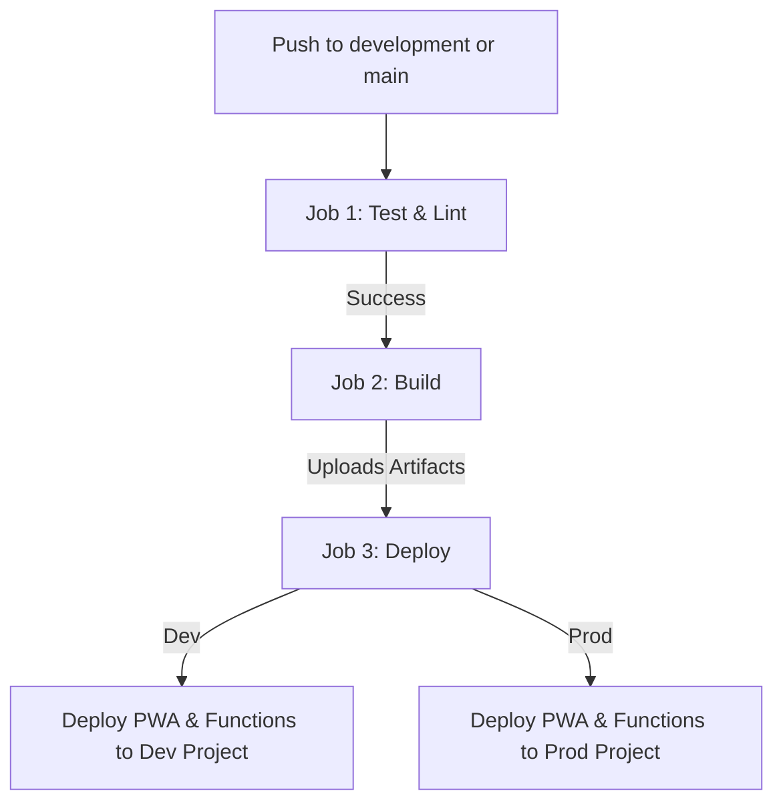

# CI/CD Reference Manual (Spendless Monorepo)

This document serves as the official reference guide for the Spendless monorepo CI/CD architecture. The pipeline unifies testing, linting, building, and deployment of the Ionic PWA client and Firebase Cloud Functions under a single automated configuration.

---

## 1. Pipeline Architecture

The entire build and deployment pipeline is defined in a single GitHub Actions workflow file:
* **Workflow Location**: [.github/workflows/deploy.yml](file:///D:/repos/spendless/spendless.ionic.pwa/.github/workflows/deploy.yml)

### Decoupled Jobs Structure
To improve feedback times and control costs, the pipeline is divided into three sequential, decoupled jobs:



1. **`test_and_lint` (Lints, Type Checks, and Tests)**:
   * **Scope**: Runs instantly without environment bounds (does not require manual approvals).
   * **Validation Gates**: Executes Biome linting, TypeScript compiler checks (`tsc --noEmit`), and workspace unit tests.
2. **`build` (Compiles Code and Packages Assets)**:
   * **Scope**: Runs only if `test_and_lint` passes. Environment-free.
   * **Release Integration**: On the `main` branch, runs `npx semantic-release` first to calculate version increments.
   * **Compilation**: Builds the PWA client (`dist`) and compiles Cloud Functions (`lib` + templates copying).
   * **Artifact Storage**: Packages and uploads the build outputs (`pwa-dist` and `functions-lib`) as temporary GitHub artifacts.
3. **`deploy` (Applies Scopes and Deploys to Firebase)**:
   * **Scope**: Runs only if `build` passes. Binds to the target GitHub Environment (`development` or `production`). 
   * **Approvals**: Pauses for manual reviewer approval on the `production` environment before starting.
   * **Deploys**: Downloads the pre-built artifacts and runs Firebase deployment commands using a `--no-predeploy` execution model for functions (ensures the exact compiled code from Job 2 is shipped).
   * **Dev Version Tagging**: Automatically creates a `-dev.{run_number}` git tag and pushes it to origin on the `development` branch.

---

## 2. Environments and Targets

The monorepo deploys to two distinct Firebase projects based on the active branch:

| Branch | GitHub Environment | Target Firebase Project | Automated Deploys |
| :--- | :--- | :--- | :--- |
| **`development`** | `development` | `spendless-dev-15971` | PWA Client + Firestore Config + Functions |
| **`main`** | `production` | `spendless-prod-24e2c` | PWA Client + Firestore Config + Functions |

### Target Mapping in [.firebaserc](file:///D:/repos/spendless/spendless.ionic.pwa/.firebaserc)
Because the codebase defines multiple hosting targets (`pwa` and `website`), Firebase needs target associations to map target names to actual site IDs:

* **Development Mappings**:
  * Target `pwa` → Site `spendless-dev-15971` (PWA client URL: https://spendless-dev-15971.web.app)
  * Target `website` → Site `spendless-dev-landing` (Dev landing page URL: https://spendless-dev-landing.web.app)
* **Production Mappings**:
  * Target `pwa` → Site `spendless-prod-24e2c` (Production app URL: https://spendless-prod-24e2c.web.app)
  * Target `website` → Site `spendless-landing-page` (Prod landing page URL: https://spendless-landing-page.web.app)

---

## 3. Required GitHub Secrets and Variables

Configure these values in GitHub under **Settings > Secrets and variables > Actions** under their respective Environments:

### GitHub Environment Secrets (Sensitive Configurations)

| Secret Name | Purpose | Value Example / Format |
| :--- | :--- | :--- |
| **`FIREBASE_SERVICE_ACCOUNT`** | Google Cloud Service Account credentials JSON key with IAM roles to deploy functions and hosting. | `{"type": "service_account", ...}` |
| **`FIREBASE_API_KEY`** | Firebase client Web SDK API Key. | `AIzaSyA1...` |
| **`FIREBASE_AUTH_DOMAIN`** | Firebase authentication domain. | `spendless-dev-15971.firebaseapp.com` |
| **`FIREBASE_PROJECT_ID`** | Target Firebase Project ID. | `spendless-dev-15971` |
| **`FIREBASE_STORAGE_BUCKET`** | Storage bucket URL for the application. | `spendless-dev-15971.firebasestorage.app` |
| **`FIREBASE_MESSAGING_SENDER_ID`**| Messaging sender ID. | `160385446081` |
| **`FIREBASE_APP_ID`** | Web App ID registered in Firebase. | `1:160385446081:web:...` |
| **`SENTRY_DSN`** | Sentry DSN URL used for reporting client/server errors. | `https://abc@o123.ingest.sentry.io/456` |
| **`MAILGUN_API_KEY`** | Mailgun API Key used to send emails. | `key-abc123xyz...` |
| **`MAILGUN_DOMAIN`** | Mailgun sending domain. | `mg.spendlessapp.com` |
| **`STRIPE_PRICE_ID_MONTHLY`** | Stripe Monthly Premium Subscription Price ID. | `price_1PabcXYZ...` |
| **`STRIPE_PRICE_ID_ANNUAL`** | Stripe Annual Premium Subscription Price ID. | `price_1PdefUVW...` |
| **`STRIPE_SECRET_KEY`** | Stripe API Secret Key (automatically synced to GCP Secret Manager). | `sk_test_51Pabc...` |
| **`STRIPE_WEBHOOK_SECRET`** | Stripe Webhook Signing Secret (automatically synced to GCP Secret Manager). | `whsec_abc123...` |
| **`GEMINI_API_KEY`** | Google Gemini API Key for AI Checkins (automatically synced to GCP Secret Manager). | `AIzaSyB...` |
| **`SEMANTIC_RELEASE_TOKEN`** | (Required in `production` only) GitHub PAT for tagging and releasing on `main`. | `ghp_abc123...` |

### GitHub Environment Variables (Non-Sensitive Configurations)

| Variable Name | Purpose | Value Example / Format |
| :--- | :--- | :--- |
| **`DATABASE_ID`** | The target Firestore database instance name. | Defaults to `(default)` if not set. |

---

## 4. Google Cloud Secret Manager Syncing

To secure sensitive keys in Cloud Functions v2, the pipeline automatically syncs three credentials directly to GCP Secret Manager during the deployment step:
1. `STRIPE_SECRET_KEY`
2. `STRIPE_WEBHOOK_SECRET`
3. `GEMINI_API_KEY`

This is done via:
```bash
echo -n "${{ secrets.STRIPE_SECRET_KEY }}" | npx firebase functions:secrets:set STRIPE_SECRET_KEY --project ${{ secrets.FIREBASE_PROJECT_ID }} --force
```
At runtime, these secrets are securely loaded into memory using Firebase's `defineSecret()` API.

---

## 5. Excluded Components (Landing Page Website)

Following project guidelines, the landing page website ([apps/website](file:///D:/repos/spendless/spendless.ionic.pwa/apps/website)) is excluded from automated deployment and checking pipelines:

1. **Excluded from Linting**: The directory is ignored in root [biome.json](file:///D:/repos/spendless/spendless.ionic.pwa/biome.json) to prevent validation errors in local codechecks.
2. **Excluded from Deployments**: The `Deploy Hosting` step in `deploy.yml` targets only `hosting:pwa`. The website is never deployed automatically.
3. **Manual Deployment**: Deployment is performed manually either:
   * **Via GitHub Actions**: Run the **Deploy Landing Page (Website)** manual workflow ([deploy-website.yml](file:///D:/repos/spendless/spendless.ionic.pwa/.github/workflows/deploy-website.yml)) from the Actions tab (targets the `production` environment).
   * **Via Local CLI**: Run separate local CLI commands.

---

## 6. Manual CLI Commands

Use these commands for local developer verification or manual deployment:

* **Verify / Test Whole Workspace**:
  ```bash
  npm run lint        # Lint all workspace packages (skips website)
  npm run typecheck   # Typecheck all TypeScript workspaces
  npm test            # Run all unit tests
  npm run build       # Build all workspaces
  ```
* **Deploy Only PWA Hosting (Client)**:
  ```bash
  npx firebase deploy --only hosting:pwa --project spendless-dev-15971
  ```
* **Deploy Only Landing Page (Website)**:
  ```bash
  npx firebase deploy --only hosting:website --project spendless-dev-15971
  ```
* **Deploy Cloud Functions Manually**:
  ```bash
  # Ensure your local apps/cloud-functions/functions/.env file exists
  # Then run:
  npx firebase deploy --only functions --project spendless-dev-15971
  ```
